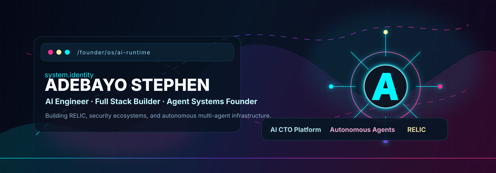
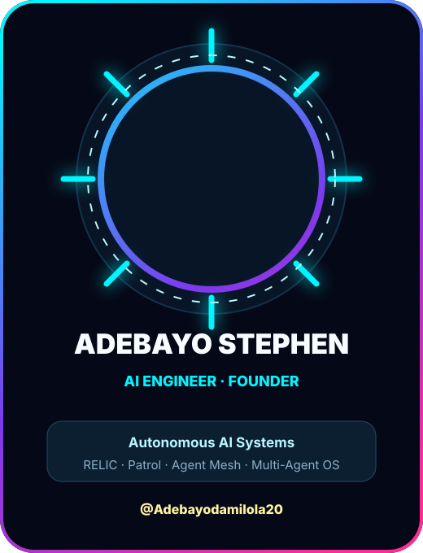
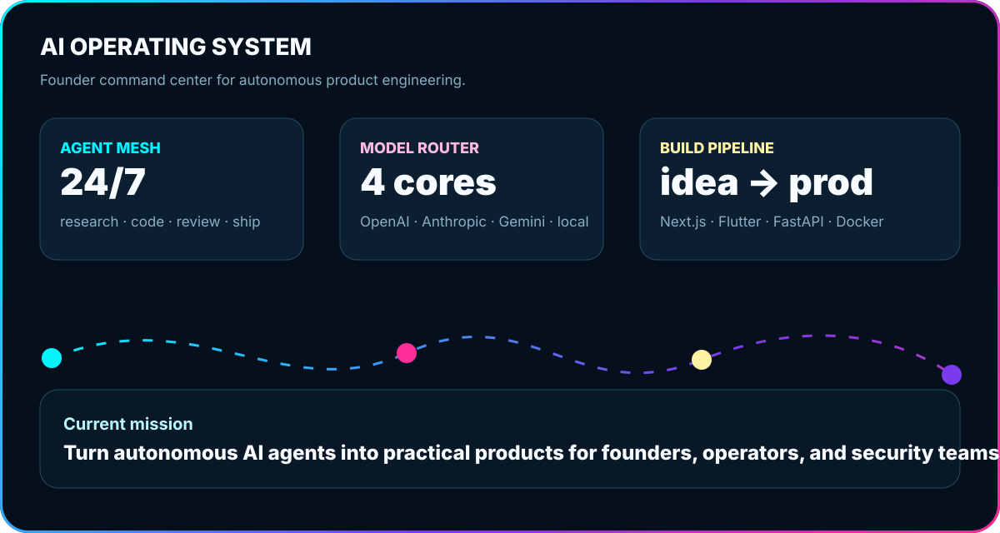
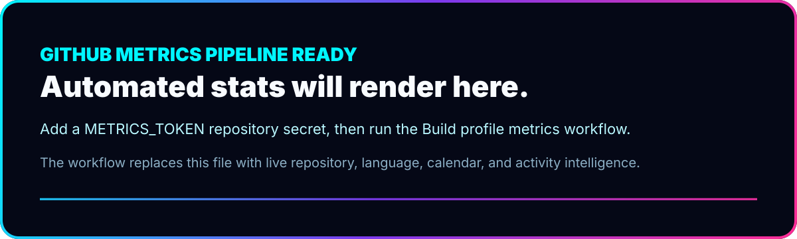

<p align="center">
  
</p>

<p align="center">
  
</p>

<p align="center">
  <a href="https://github.com/Adebayodamilola20"></a>
  <a href="https://github.com/Adebayodamilola20?tab=followers"></a>
  <a href="https://github.com/Adebayodamilola20?tab=repositories"></a>
</p>

<br />

<table>
  <tr>
    <td width="34%" valign="top">
      <p align="center">
        
      </p>
    </td>
    <td width="66%" valign="top">
      <h1>ADEBAYO STEPHEN</h1>
      <h3>AI Engineer · Full Stack Developer · Flutter Developer · Agent Systems Founder</h3>
      <p>
        I build autonomous AI systems that behave less like demos and more like production infrastructure:
        agent orchestration, AI-native developer platforms, security ecosystems, and founder tools that turn
        intent into shipped software.
      </p>
      <p>
        Current operating thesis: the next generation of startups will be built by small teams controlling
        networks of specialized AI agents, model routers, product pipelines, and automated execution loops.
      </p>
      <p>
        <a href="mailto:adebayodamilola2007@gmail.com"></a>
        <a href="https://www.linkedin.com/in/your-linkedin"></a>
        <a href="https://www.buymeacoffee.com/yourname"></a>
      </p>
    </td>
  </tr>
</table>

<p align="center">
  
</p>

## AI Operating System

<p align="center">
  
</p>

<table>
  <tr>
    <td width="25%" align="center">
      
      <h3>RELIC</h3>
      <p><strong>AI CTO Platform</strong><br />A founder command layer for planning, building, reviewing, and shipping software with AI agents.</p>
    </td>
    <td width="25%" align="center">
      
      <h3>Patrol Security</h3>
      <p><strong>Security Ecosystem</strong><br />A modern security stack connecting field operations, incident intelligence, and real-time workflows.</p>
    </td>
    <td width="25%" align="center">
      
      <h3>Agent Mesh</h3>
      <p><strong>Autonomous AI Agents</strong><br />Specialized agents for research, execution, coding, QA, product strategy, and operations.</p>
    </td>
    <td width="25%" align="center">
      
      <h3>Multi-Agent Systems</h3>
      <p><strong>Model-Orchestrated Systems</strong><br />LangGraph, OpenAI, Anthropic, Gemini, and custom tool-calling pipelines.</p>
    </td>
  </tr>
</table>

## Current Focus

```txt
mission: build practical autonomous AI infrastructure for founders and operators
stack:   Flutter + Next.js + Node.js + Python + FastAPI + LangGraph
models:  OpenAI + Anthropic + Gemini
data:    PostgreSQL + Supabase + Convex
ship:    Docker + GitHub Actions + production feedback loops
```

## Currently Building

| System | What it does | Status |
| --- | --- | --- |
| **RELIC** | AI CTO platform for autonomous software execution | `private beta architecture` |
| **Patrol Security Ecosystem** | Security operations platform for modern field teams | `active build` |
| **Autonomous AI Agents** | Role-based agents that research, code, review, and operate | `daily experiments` |
| **Multi-Agent Systems** | Coordinated agent workflows with memory, tools, and model routing | `core infrastructure` |

## Technology Stack

<p align="center">
  
</p>

<p align="center">
  
  
  
  
  
</p>

## Founder Timeline

| Era | Signal |
| --- | --- |
| **Phase 01** | Built production-grade full stack foundations across React, Flutter, Node.js, Python, and PostgreSQL. |
| **Phase 02** | Moved into AI-native development: model APIs, agentic workflows, orchestration, and automated product loops. |
| **Phase 03** | Founded and shaped RELIC as an AI CTO platform for founders building with autonomous agents. |
| **Phase 04** | Building security and multi-agent systems that combine real-world operations with AI execution. |

## Experience Matrix

| Role | Operating Range |
| --- | --- |
| **AI Engineer** | LLM integration, tool calling, multi-agent workflows, prompt systems, AI product architecture |
| **Full Stack Developer** | Next.js, React, Node.js, FastAPI, PostgreSQL, Supabase, Convex, Docker |
| **Flutter Developer** | Cross-platform mobile apps, polished UI systems, production app architecture |
| **AI Agent Engineer** | Autonomous agents, model routing, state graphs, memory, evaluation, automation pipelines |
| **Founder** | Product strategy, technical leadership, rapid prototyping, platform thinking, execution systems |

## GitHub Intelligence

<p align="center">
  
  
</p>

<p align="center">
  
  
</p>

<p align="center">
  
</p>

<p align="center">
  
</p>

## Metrics Console

<p align="center">
  
</p>

## WakaTime

<!--START_SECTION:wakatime-->

```txt
WakaTime automation is ready.
Add WAKATIME_API_KEY as a repository secret, then run the workflow.
```

<!--END_SECTION:wakatime-->

## Now Playing

<p align="center">
  <a href="https://open.spotify.com/user/your-spotify-user-id">
    
  </a>
</p>

## Featured Repositories

<p align="center">
  <a href="https://github.com/Adebayodamilola20/RELIC">
    
  </a>
  <a href="https://github.com/Adebayodamilola20/PatrolSecurity_Ecosystem">
    
  </a>
</p>

## Live Project Cards

| Project | Signal | Stack |
| --- | --- | --- |
| **RELIC** | AI CTO platform for founders building with autonomous software agents | Next.js · Node.js · Python · LangGraph · OpenAI |
| **Patrol Security Ecosystem** | Security operations product with intelligence, dispatch, and monitoring layers | Flutter · React · Supabase · PostgreSQL |
| **Autonomous AI Agents** | Agent workflows that coordinate coding, research, planning, and execution | Python · FastAPI · Anthropic · Gemini |
| **Multi-Agent Systems** | Tool-using AI systems with routing, memory, evaluation, and runtime supervision | LangGraph · TypeScript · Docker |

## Contact

<p align="center">
  <a href="mailto:adebayodamilola2007@gmail.com"></a>
  <a href="https://github.com/Adebayodamilola20"></a>
  <a href="https://www.linkedin.com/in/your-linkedin"></a>
</p>

<p align="center">
  <strong>Building the future of AI-native software execution.</strong>
</p>
