<table>
  <tr>
    <td width="38%" valign="top">
      
    </td>
    <td width="62%" valign="top">
      <h1>ADEBAYO STEPHEN</h1>
      <h3>AI Engineer · Full Stack Developer · Flutter Developer · React Developer</h3>
      <p>
        I build software across AI, web, mobile, and backend systems. My current work focuses on autonomous
        agents, founder tools, security platforms, and practical AI products that can move from idea to production.
      </p>
      <p>
        I work with Flutter, React, Next.js, Node.js, Python, TypeScript, FastAPI, PostgreSQL, Supabase,
        Convex, Docker, GitHub Actions, OpenAI, Anthropic, Gemini, and LangGraph.
      </p>
      <p>
        <a href="mailto:adebayodamilola2007@gmail.com"></a>
        <a href="https://github.com/Adebayodamilola20"></a>
      </p>
    </td>
  </tr>
</table>

## Current Work

| Project | Focus |
| --- | --- |
| **RELIC** | AI CTO platform for planning, building, and shipping software with agents |
| **Patrol Security Ecosystem** | Security operations platform for teams and field workflows |
| **Autonomous AI Agents** | Agents for research, execution, coding, review, and operations |
| **Multi-Agent Systems** | Model routing, tool use, memory, orchestration, and evaluation |

## Stack

```txt
Mobile:     Flutter
Frontend:   React, Next.js, TypeScript
Backend:    Node.js, Python, FastAPI
Database:   PostgreSQL, Supabase, Convex
AI:         OpenAI, Anthropic, Gemini, LangGraph
DevOps:     Docker, GitHub Actions
```

## GitHub

<p>
  
  
</p>

<p>
  
</p>

## Featured

<p>
  <a href="https://github.com/Adebayodamilola20/RELIC">
    
  </a>
  <a href="https://github.com/Adebayodamilola20/PatrolSecurity_Ecosystem">
    
  </a>
</p>

## Contact

```txt
Email:  adebayodamilola2007@gmail.com
GitHub: github.com/Adebayodamilola20
```
